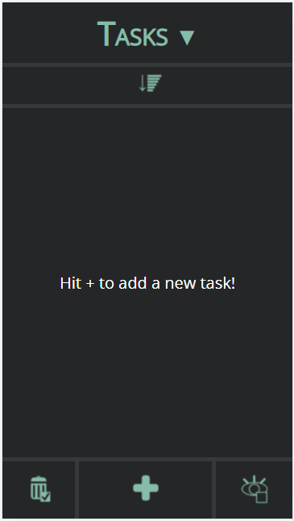
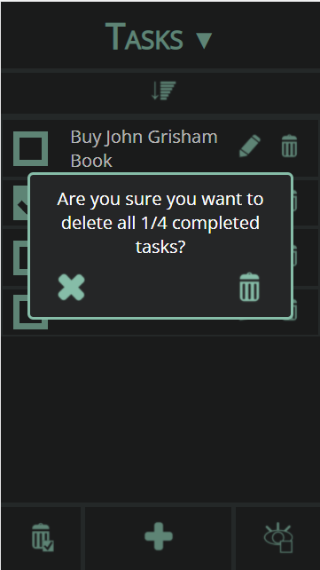
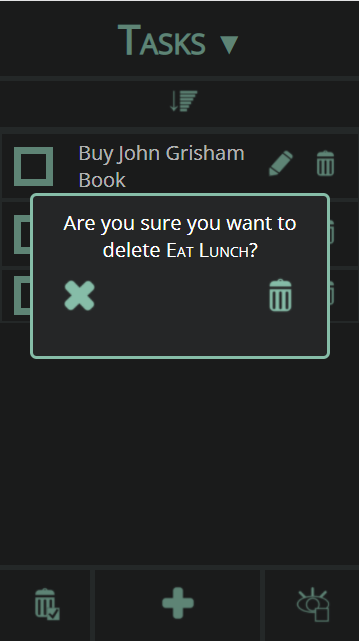

# Design 

## Design Decisions

We decided to choose a soothing dark mode theme in order to reduce eye strain on users (and because we liked it). We decided to restrict our color palette to only four colors in order to remain consistent: grey, slightly darker grey, mint green, and white. 

Instead of words, we decided to use icons to represent each function in order to reduce visual clutter (and avoid arguments about whether "incomplete" or "uncompleted" is a better word to use). We chose our icons based on representative images for each function: A trash can for delete, a pencil for edit, a plus sign for add, etc. Some of the other buttons were a little more complicated: for "show uncompleted," we went with an icon of an eye and an unchecked box, and for "delete completed," we created an icon of a trash can with a checked box. Additionally, the "toggled" version of "show uncompleted" changes to an icon of an eye with two boxes - one checked and one unchecked - to represent that pressing it again will show all tasks, completed and uncompleted. 

Consistent with many other mobile-based applications, we placed our  three main functions (delete copmleted, new task, and show uncompleted) in a menu bar across the bottom of the screen. Individual tasks appear above this menu, with their individual options (check, delete, and edit) located beside them. Each task's options are thus associated with a single task to avoid confusion with the overall main functions.

When the list is empty, we chose to put explanatory text on the screen in the task area, prompting users to use the "plus" icon to add a task to the list. We did this to reduce user confusion surrounding the concerningly empty screen.

## Alternative Design Ideas
For the "show uncompleted" button, we briefly considered an alternate icon depicting a checklist with the incomplete items at the top, and complete items at the bottom; however, upon further analysis, we realized that this icon was not only a poor representation of the function of the button, but it was also a little vague, and the sizing would have been fairly small and difficult to see. 

For the toggled version of the aforementioned button, we considered also using an icon of the eye and checkbox with a slash through it; however, we thought that this would probably be read by users as "hide uncompleted," where its real function would be more akin to "show all" (both uncompleted and completed). We instead made a design that shows the same eye icon, but with both a checked and unchecked box, to better represent that pressing it will make both uncompleted and completed tasks visible.

Initially, our design had the edit and delete options swapped on the task options. We decided instead that edit should be on the left, closer to the text that you're editing, and delete should be further to the side of the screen, so you're less likely to accidentally click it. 

## User Testing
### Test Subject One: Mads's suitemate, Fontaine
Fontaine thought our app design was "sick," and noted that the buttons' functions were intuitive. 
In particular, he said that the eye button's change in design when toggled helped him to understand its function, despite initial confusion.
He was interested in what it would look like at different screen sizes, so we changed it from Moto G4 to a few different smartphone options on the market, for curiosity's sake.
### Test Subject Two: Mads's other suitemate's girlfriend, Sath
Sath said our design was "neat."
There was slightly more friction in understanding the function of some of the buttons (particularly, view all/delete all buttons).
However, after toggling the view button a few times and noting the change in the icon, she did, in fact, guess its functionality correctly. 

## Final Design
    
### Adding to an empty list

_Figure 1a: An empty list_

Pressing the "plus" icon should lead to a screen like the following, on which you can enter a name for a task:

_Figure 1b: Adding the task "Buy John Grisham Book" to a new list_

Pressing the "complete edit" icon, represented by a pencil with a checkmark, should result in the next screen:

_Figure 1c: The task "Buy John Grisham Book" has been added to a new list._

Yay, your task has been added.

### Adding to an existing list

_Figure 2a: An existing list_

Pressing the "plus" icon should lead to the following screen, on which you can enter a name for a task:

_Figure 2b: Adding the task "Eat Lunch" to an existing list_

Then, pressing the "complete edit" icon, represented by a pencil with a checkmark, should result in the next screen:

_Figure 2c: The task "Eat Lunch" has been added to an existing list_

Yay, your task has been added.

### Marking a task completed

_Figure 3a: Marking the task "Call Mom" completed_

Clicking the check box next to "Call Mom" will lead to the following screen:

_Figure 3b: The task "Call Mom" has been marked completed_

Yay, your task is now (marked as) complete!

### Renaming a task

_Figure 4a: An existing list, including the task "Text John"_

Clicking on the pencil icon next to the "Text John" task label will lead to the following screen:

_Figure 4b: Renaming the task "Text John"_

Then, after editing the name, pressing "done" or "enter" on your phone keyboard, or tapping outside of the textbox, should result in the next screen:

_Figure 4c: The task "Text John" has been renamed to "Text John about bank statements"_

Yay, you have renamed your task!

### Viewing uncompleted tasks

_Figure 5a: Before selecting "view all uncompleted"_

Clicking on the eye with blank check box icon in the bottom right-hand corner will lead to the following screen:

_Figure 5b: After selecting "view all uncompleted"_

Yay, now you can only see uncompleted tasks. Additionally, the icon has changed: if you were to tap it again, you should see all tasks again.

### Deleting completed tasks

_Figure 6a: Before selecting "delete all completed"_

Clicking on the trash can with check box icon in the bottom left-hand corner will lead to the following screen with a confirmation pop-up:

_Figure 6b: After selecting "delete all completed"_

In order to confirm deletion, users will need to click on the "trash" icon, leading to the following screen:

_Figure 6c: After selecting the "trash" icon on the confirmation pop-up_

Yay, you have deleted all completed tasks.

### Deleting One Task

_Figure 7: Before selecting "delete"_

Clicking on the trash can next to a task will bring up this confirmation pop-up featuring the task's text.

### Resizing of edit box

We saw that sometimes, the text in the edit box would start "scrolling" off the viewable area. We saw on Piazza that another group was asking about ways to fix this, and decided to implement it ourselves as well.

_Figure 8a: Before the change_

_Figure 8b: After the change_

### Priority Sorting

We added the ability to choose a priority level for each task. We considered a variety of options, including flags, but ultimately chose to indicate priority level by the saturation of the box's color to keep things streamlined and save space.

With the addition of this new feature, in order to exit out of editing a task, you must select the "complete editing" button, indicated by a pencil icon with a checked box.

_Figure 9a: The priority selection menu._

The top button on the screen will then pull up the sort menu:

_Figure 9b: The sorting options menu._

Now, you may choose to sort by name, date of creation, or our new priority option. The currently selected option will be highlighted in mint. The arrow on the left-hand side of the menu ribbon will toggle to sort by ascending OR descending.

### Multiple Lists

We added the ability to create multiple, separate lists, and switch freely between them. To switch lists or create a new list, open the list selection menu by clicking on the triangle to the right of the list's name. Note that you may also click on the title itself and get the same results; the triangle was just used as a visual cue that there is more content.

_Figure 10a: The list selection menu_

From here, you may choose x to cancel and go back to the previous list, + to create a new list, or check to confirm your selection.  
If you choose to create a new list, your next screen will look like this:

_Figure 10b: A new list has been added_

And finally, clicking the check mark to confirm will bring you to your new list.

_Figure 10c: A new, empty list_

The original list, as well as any other lists you may have, can be viewed by accessing the aforementioned list selection menu.

### Accessibility

Keyboard navigation can be done using the tab key to change selected, and using the enter key to select any buttons. Do note, however, that it is the space key, NOT enter, which is used to mark checkboxes, as is the standard.
[https://youtu.be/dN2qLjgu9Rw](https://youtu.be/dN2qLjgu9Rw
)

Screen Reader support was added through the addition of numerous aria labels, which describe the function of each button as it is selected.      
[https://youtu.be/Y6Vc5M991T0](https://youtu.be/dN2qLjgu9Rw
)

## Challenges
One challenge was designing checkboxes that would fit with the overall aesthetic of the rest of our UI. The default checkboxes with HTML don't fit our "dark mode" theme and are inconsistent across browsers. Thus, An adapted some available code for custom checkboxes in order to improve the overall quality of our design.

Another challenge was anchoring the bottom menu bar to the bottom of the screen. Previously, when too many tasks were added, the bar would simply disappear from view, being sent to the bottom of the screen. Now, it will stay visible even when more tasks are added.

Our initial color scheme had to be modified slightly in order to increase contrast to meet accessibility requirements.

All of our "buttons" were originally just images that would perform a function upon click; however, for the screen reader and tab navigation to recognize them as buttons, we had to change them all to true button objects. Figuring out how to reformat them to look nice still was a bit of a challenge.

## The CROWN JEWEL of our App Design
The icons that Mads made are our favorite part of the design. We think that the two versions of the eye icon really get the idea of "show uncompleted"/"show all" across without having to use too many words or a messy-looking, complicated icon.

